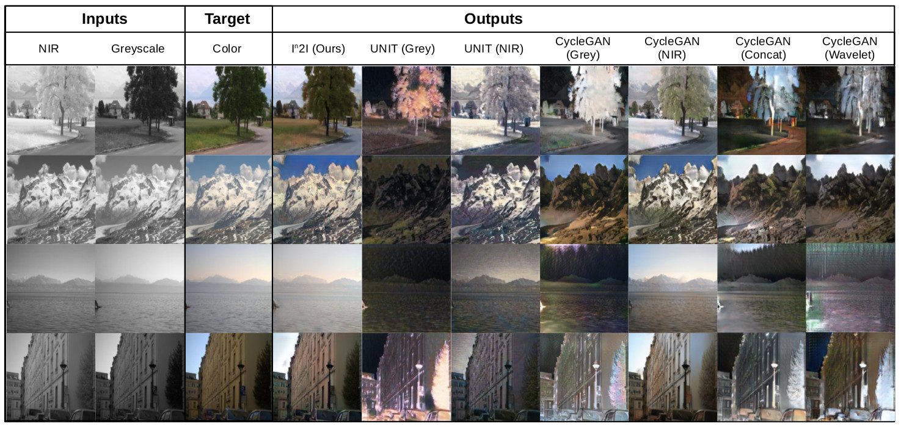
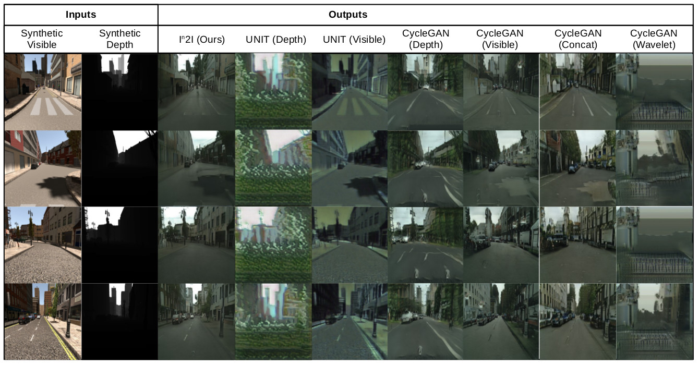
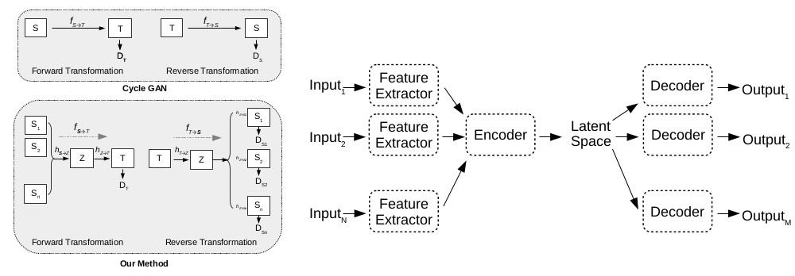
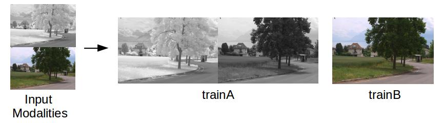

# In2I : Unsupervised Multi-Image-to-Image Translation Using Generative Adversarial Networks

This code is the implementation of the paper, <i> In2I : Unsupervised Multi-Image-to-Image Translation Using Generative Adversarial Networks</i>. Implementation is based on the CycleGAN PyTorch code written by [Jun-Yan Zhu](https://github.com/junyanz) and [Taesung Park](https://github.com/taesung89). This implementation only supports the case with two input modalities.


#### In2I : [[Project]](https://github.com/PramuPerera/In2I) [[Paper]](https://arxiv.org/abs/1711.09334)


This work, given a set of paired images from multiple modalities, a transformation is learned to translate the input into a specified domain. Sample constructions from NIR+Greyscale images to color images. 



Sample constructions from Synthetic RGB+depth images to real color images.
 


In both cases, a multi-modal Generator is used for both forward and reverse transformations. The network structure used is illustrates in the following figure:



If you use this code for your research, please cite:

<pre><code>
@inproceedings{in2i,
author = {{Perera}, P. and  {Abavisani}, M. and {Patel}, V.~M.},
title = "{I2I : Unsupervised Multi-Image-to-Image Translation Using Generative Adversarial Networks}",
Booktitle = {24th International Conference on Pattern Recognition, ICPR 2018},
Year = {2018}
}
</code></pre>


## Prerequisites
- Linux or macOS
- Python 2 or 3
- Pytorch
- Python packaged NumPy, SciPy, Visdom and Dominate 
- CPU or NVIDIA GPU + CUDA CuDNN

This code was tested on a Ubuntu 16.04 installation with CUDA 9.0

- Clone this repo:
```bash
git clone ttps://github.com/PramuPerera/In2I
cd In2I-master
```

### 
- Download a multi-modal image dataset. Eg: EPFL NIR-VIS dataset can be found from <a href=https://ivrl.epfl.ch/supplementary_material/cvpr11/>here.</a>

- Change the structure of image files. Inside the dataset directory there should be two folders, trainA and trainB, where images of input and output modalities are stored respectivly. Input images are arranged by vertically appending both modalities correspoinding to a given image (similar to how input data are prepared in pix2pix code). Following is an example of how images should be prepared for NIR+grey to RGB task:



Note that trainA image is a concatanation of NIR and greyscale images. trainB image is an RGB image. Converting input data into the said format can be done using the genDATA.py script. Change lines 12-14 to specify locations of first and second modality. Use variable destination to specify the output directory (Default is datasets/NIRtoVIS).

- For NIR+greyscale to RGB task in EPFT dataset, data preparation can be done by running genDATANIR.py script. Path to all files of the dataset should be specified by setting the <i>dataset</i> variable.

- Train a model:
```
python train.py --dataroot ./datasets/NIRtoVIS --name nirgreytovis --model cycle_gan --no_dropout --input_nc 1 --input_nc2 1 --output_nc 3
```
- To view training results and loss plots, run `python -m visdom.server` and click the URL http://localhost:8097. To see more intermediate results, check out `./checkpoints/nirgreytovis/web/index.html`
- Test the model:
```
python test.py --dataroot ./datasets/NIRtoVIS --name nirgreytovis --model cycle_gan --phase test --no_dropout
```
The test results will be saved to a html file here: `./results/nirgreytovis/latest_test/index.html`.

It should be noted that all arguments  are similar to that of CycleGAN PyTorch code. input_nc and input_nc2 specifies number of channels in each modality Generator architechture is based on ResNET and is fixed.   

